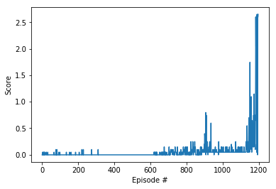

### Report

By running the file `Continuous_Control.ipynb` one can reproduce my results! 
Both the kernel and the ddpg_agent file is based on Udacity nanodegree solutions for the p1Navigation project.

The agent is defined in `ddpg_agent.py` where I defined 2 q-networks and 2 p-networks - a local and a target. The Gamma parameter is 0.99 (1 step future Q value is only considered with 99% weight), the target q-network is updated with Polyak averaging with Tau parameter of 0.001.

First I tried to create a Q-network that has a mu and a sigma parameter so I would be able to force the Policy network for exploration though it was not necessary for the solution.

The final model architecture for the Q-value estimation builds up from 2 layers with size [256,128] that transforms the state to 128 dimensional vector.
In parallel a [128] output size dense layer changes the action value to a 128 dimensional vector. Both steps are followed by ReLU activation function.
Then a concatenation layer joins the 2 vectors into a 256 dimensional vector. This is followed by 2 layers with output size of [128,1]. 
The ReLU is applied after the 128 sized output and no activation function is applied on the single output at the end.

The final model architecture for the P-value estimation is a 4 layer network with sizes of [256, 128, 64, 4]. Each layer before the last is followed by a ReLU activation function.
The last layer is followed by a tanh function, programmed in the ddpg_agent.py file itself.

### Results

I was able to solve the environment in 86 episodes.

The saved weights are in `policy.pth`. 

### Further improvements

I plan to now implement the D4PG and PPO and test them in both environments, the reacher and the crawler. The goal is to find when and where each of the algorithms have the best performance.
